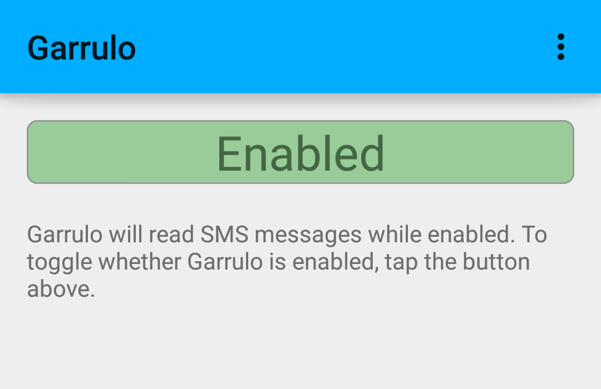
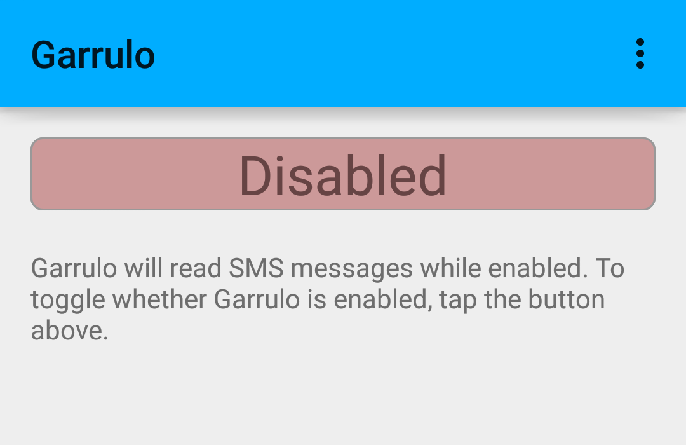

Garrulo
==================
A notification interceptor for Android phones and tablets.

Introduction
------------------
Garrulo is a small application designed to bring some smart functionality/programmability to notifications received on Android phones and tablets.

### Motivation ###
The development motivation for Garrulo was because Android doesn't have a consistent, easy-to-use, cross-device/cross-manufacturer app that will read text messages and emails while driving. More specifically, for those individuals without bluetooth integration in their cars, it's difficult to find an app that will read SMS messages and can be easily turned on using NFC (as an NFC tag can be placed on the dashboard of a car and be programmed to automatically launch Garrulo when activated - see [NFC Setup](#nfc-setup) for more details).

As time goes on, it's likely that Garrulo will provide more functionality than just SMS messages, including allowing emails, Facebook messages, Tweets, etc... to be read aloud, if desired.

Requirements
-------------
### Android Operating System Requirements ###
Currently, Garrulo only runs on **API 21+**. This means that you need at least **Android 5.0 (Lollipop)** to run Garrulo. Garrulo uses APIs that aren't in the older Android releases. There aren't any immediate plans to support devices running Android API 18-20, but we would be open to development in this direction. It is unlikely we will ever support API levels less than 18.

How to Use
------------------
### Starting Garrulo ###
Once installed, you can start Garrulo by tapping the Garrulo icon on your phone: 

Once the app starts, Garrulo will automatically begin reading SMS messages for you.

### Main Garrulo UI ###
Garrulo will display the following graphical interface for you to interact with it:

The large indicator at the top indicates whether Garrulo is running or stopped:

<!-- Crop Spec: 0, 75 -- 1080x700px -->

### Stopping Garrulo ###
You can stop Garrulo from reading new notifications by tapping on the "Enabled" indicator when Garrulo is running. Similarly, you can request that Garrulo begin reading notifications again by tapping this indicator when Garrulo is disabled.

Alternatively, you can stop Garrulo by opening the task manager (square button) and swiping Garrulo closed.

Additional Configuration
------------------------
There are a few configuration options under the Settings menu, accessible from the upper right hand menu on the Garrulo main user interface:

### Suppressing Default Notification Sounds ###
It can be somewhat annoying for the default notification sound to be played when Garrulo handles a notification. The audio of the default notification sound is unnecessary, since Garrulo will be playing its own audio when a message arrives. In addition, this notification sound can interfere with the ability to clearly hear and understand Garrulo's reading of the notification.

To suppress the default notification sound for any messages that Garrulo handles, turn on the option **Suppress Default Notification** from the **General** category of Garrulo's settings menu.

### Allowing Ducking ###
___Ducking___ is a term used to describe a different type of audio focus management. Normally, when an app that has audio focus (i.e. it's playing something) loses audio focus, it pauses its playback to ensure that audio is not being played from multiple applications, making them unintelligible. In contrast, an app can "duck" another app, which means that the audio will continue playing, but at a lower volume, while another application has audio focus.

Garrulo can allow another app (e.g. a music player) to duck while Garrulo reads notifications for you. To enable this setting, turn on the **Allow Volume Ducking** option from the **General** category of Garrulo's settings menu.

### NFC Setup ###
### Using in Combination with Google Now ###

Security and Privacy
---------------------
### Permissions Requested ###
The following is an explanation of why Garrulo requests the permissions it does:

  Name | Permission ID | Reason
  ---- | ------------- | -------
       | android.permission.RECEIVE_SMS | Garrulo needs this permission to intercept SMS messages in order to read them out loud.
       | android.permission.READ_CONTACTS | When Garrulo reads a new SMS message, it attempts to search for the contact in your Contacts. This is so that Garrulo can read "New Text Message from John Snow", rather than "New Text Message from +15551112222", if it finds that John Snow is listed in your Contacts with the number +15551112222.
       | android.permission.READ_PHONE_STATE | This permission is used to read information about the phone state, such as the phone number. It's also used by apps to mute audio output if you receive a call. Garrulo used to use this permission to identify your phone number, so that if it needed to, it could replace your name or phone number with "you". It doesn't do this anymore, though, so we're researching whether we can remove this permission, and it may be removed in future versions.

### Privacy ###
Garrulo does not collect any private data that is specific to you (e.g. text messages, phone numbers, contacts, etc...). In fact, we don't collect any data for later use _at all_.

We use [Google's Text to Speech](http://android-developers.blogspot.com/2009/09/introduction-to-text-to-speech-in.html) engine to synthesize your text messages, however, so your text messages are synthesized using this engine. Since how this works is somewhat abstracted from the application developer, we don't know what their privacy policies and data storage/transmission policies are. As such, it's possible that your text messages _could_ be stored by Google, although this seems somewhat unlikely, given privacy laws in the United States and elsewhere. It's important to note, though, that the developers of Garrulo in no way have access to this data, and thus are not responsible for any problems arising from the storage, use, transmission, writing, or reading of these text messages.

Finally, we do intend to collect data about crashes and unresponsiveness in the Garrulo application in the near future. This data will be technical in nature, will not include personal information, and to the extent possible, will attempt to obfuscate anything that might identify you as an individual. This data will only be collected for technical improvement of the Garrulo app and basic analytics (not for advertisement targeting), will be prohibited from being used for any other purpose, and will not be stored for long periods of time (other than for long-running crashes or open tickets).

### Questions ###
If you have a question about our security and privacy policies, please feel free to contact us, either by [filing a support request ticket](https://github.com/glasstowerstudios/garrulo/issues/new), or by emailing us at `jaywir3{at}gmail{dot}com`.
